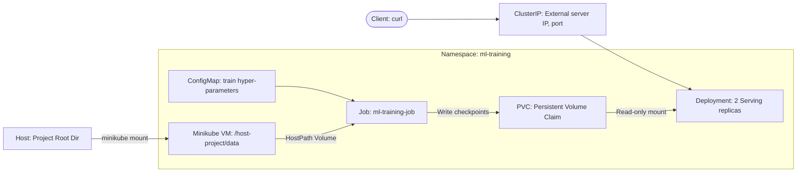

# Mlops Pytorch Pipeline

## Architecture Diagram



## Install & Run

**Pre-Requisite Tooling**: `git lfs`, `docker`, Kubernetes (`kubectl` and `minikube` for local cluster setup)

- Start a local Kubernetes cluster (in the background) using Minikube: `minikube start --driver=docker --cpus=4 --memory=6144`
- In a separate dedicated terminal run:

```bash
$ minikube mount $(pwd):/host-project
📁  Mounting host path /home/sohang/Projects/mlops-pytorch-pipeline into VM as /host-project ...
...
```

- Run the rest of the workflow steps in a different terminal:

```bash
# Build training and serving docker images inside minikube's environment
$ eval $(minikube docker-env)
$ docker build -f docker/Dockerfile.train -t mlops-train:v1 .
$ docker build -f docker/Dockerfile.serve -t mlops-serve:v1 .

# Apply Training Manifest YAML files to start Training Job in Kubernetes
$ kubectl apply -f k8s/namespace.yaml 
$ kubectl apply -f k8s/configmap.yaml 
$ kubectl apply -f k8s/training-job.yaml

# After Training Job is done, apply Serving Manifests to start Serving Job in Kubernetes
$ kubectl apply -f k8s/serving-deployment.yaml      # starts 2 prediction server replicas
$ kubectl apply -f k8s/serving-service.yaml         # presents one stable server IP, port that internally calls the 2 replicas

# Verify Pods are running and healthy
$ kubectl get pods -n ml-training
$ kubectl describe deployment ml-serving-deployment -n ml-training

# Test Prediction Endpoint (using the file test_images/car.jpeg included in this repo)
$ curl -X 'POST' \
  'http://127.0.0.1:8080/predict' \
  -H 'accept: application/json' \
  -H 'Content-Type: multipart/form-data' \
  -F 'file=@test_images/car.jpeg;type=image/jpeg'
"car"
```

## Testing Documentation Examples

`doctest` is utilized to ensure all code examples given in docstrings run correctly. Run all tests like this:

```bash
$ python -m doctest src/*.py
```

## Git Commits

To ensure conformity with *Conventional Commits* style, `npm install -g git-cz` was installed and `git cz` was used (it interactively asks a few questions and then internally does `git commit`).